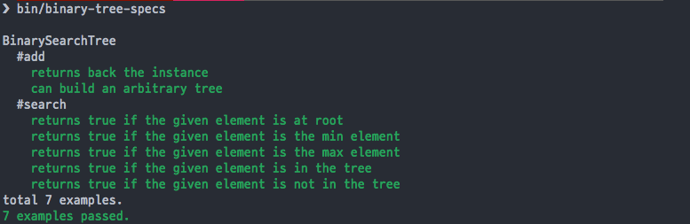

# CMake/C++ Project Template with CCSpec as Submodule

This project is a derivative of [ccspec-example](https://github.com/zhangsu/ccspec-example/) project, however this repo fixes some compilation and build issues in the original repo.

It provides a simple C++ project template that integrates with the [ccspec](https://github.com/zhangsu/ccspec) unit testing library, however we are using an [updated fork](https://github.com/kigster/ccspec), which itself is a fork of [this fork](https://github.com/simonwu-os/ccspec) which fixes coloring and other nuances.

#### See Also

 * [CMake Project Template](https://github.com/kigster/cmake-project-template) project that uses the [Google Test Library](https://github.com/google/googletest).

## Usage

You need to have:

 * recent C++ compiler that supports C++17
 * recent `cmake` installed

 First, clone the project into a folder:

```bash
$ git clone https://github.com/kigster/cmake-ccspec-template
$ cd cmake-ccspec-template
```

### Automated Build

You can use the provided BASH script `./run.sh` to build and run all the tests.

### Manual Build

Start by initializing ccspec git submodule. This step is crucially important, as it pulls the `ccspec` library into the project.

```bash
$ git submodule init && git submodule update
```

Next we can use standard CMake semantics to build our project:

```bash
$ mkdir -p build && cd build
$ cmake ..
$ make -j 4 
$ make install
$ cd ..
```

This should build all dependencies, and then you can run the tests:

```bash
$ bin/binary-tree-specs
```

You should see something like the following output:



## Acknowledgements

*People:*

 * [Su Zhang (張甦)](https://github.com/zhangsu)
 * [simonwu-os](https://github.com/simonwu-os)

*Repos:*

 * [ccspec original](https://github.com/zhangsu/ccspec)
 * [ccspec original example](https://github.com/zhangsu/ccspec-example/)
 * [ccspec fork](https://github.com/simonwu-os/ccspec)
